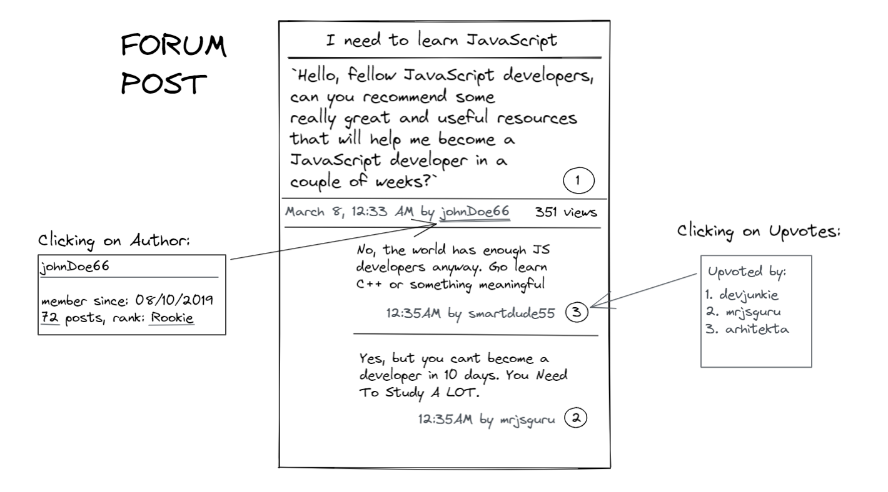

## Design a Forum Post

In this exercise, the goal is to represent the data required to visualize a forum post. A forum post is a complex object that has many key components - pieces of data such as title, content, author, date the post was created, likes by different people, a lot of replies, and information about the authors of the initial post and the replies. Refer to the picture below to get a better idea. Try to create an object that captures all the necessary information. 

Remember, there are many possible solutions.

